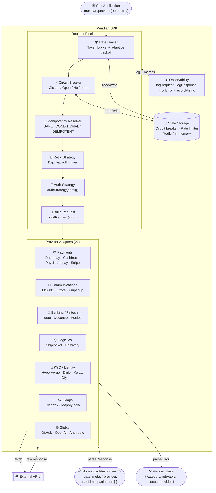

<div align="center">
Meridian

**One SDK. Every API. Zero inconsistency.**

A TypeScript-first SDK that enforces a single stable contract across all third-party API providers — normalizing error handling, rate limiting, pagination, and response shapes so your application code never changes when providers do. Deep coverage of the Indian tech ecosystem alongside global providers.

[](https://www.npmjs.com/package/meridianjs)
[](https://www.npmjs.com/package/meridianjs)
[](LICENSE.md)
[](https://www.typescriptlang.org/)
[](https://nodejs.org)
[](https://vitest.dev)
[](#provider-coverage)

[Installation](#installation) · [Quick Start](#quick-start) · [Providers](#provider-coverage) · [Architecture](#architecture) · [API](#public-api) · [Roadmap](ROADMAP.md) · [Contributing](CONTRIBUTING.md)

</div>

## Problem Statement

Applications integrating multiple third-party APIs face inconsistent response formats, error structures, rate limit behaviors, and pagination strategies. This fragmentation requires provider-specific error handling, retry logic, and data transformation code that is difficult to maintain and test.

Meridian provides a single abstraction layer that normalizes these differences, allowing applications to interact with any provider through a consistent interface while maintaining type safety and resilience patterns.

```typescript
// Same interface. Every provider. Always.
const { data, meta } = await meridian.provider("razorpay").get("/v1/payments/pay_123");
console.log(meta.rateLimit.remaining); // normalized from any provider
console.log(meta.provider);            // "razorpay"
```

If Razorpay changes their error format tomorrow, you don't change a line of your code.

---

## Installation

```bash
npm install meridianjs
```

**Requires Node.js ≥ 18.0.0** (`fetch`, `Headers`, `AbortController`, `crypto.randomUUID` used natively — no polyfills needed).

---

## Quick Start

```typescript
import { Meridian } from "meridianjs";

const meridian = await Meridian.create({
  localUnsafe: true, // for local dev — see State Management for production
  razorpay: {
    auth: {
      username: process.env.RAZORPAY_KEY_ID,
      password: process.env.RAZORPAY_KEY_SECRET,
    },
  },
  github: {
    auth: { token: process.env.GITHUB_TOKEN },
  },
});

// Payments
const order = await meridian.provider("razorpay").post("/v1/orders", {
  body: { amount: 50000, currency: "INR" },
});

// Paginate automatically — cursors handled for you
for await (const page of meridian.provider("razorpay").paginate("/v1/payments")) {
  console.log(page.data.items);
}
```

Every response has the same shape, regardless of provider:

```typescript
{
  data: T,
  meta: {
    provider: string,
    requestId: string,
    rateLimit: { limit: number, remaining: number, reset: Date },
    pagination?: { hasNext: boolean, cursor?: string },
    warnings: string[],
  }
}
```

---

## Provider Coverage

31 adapters, fully implemented and contract-tested (661 tests).

### Global

| Provider | Category | Auth |
| --- | --- | --- |
| **GitHub** | Developer Tools | Bearer token |
| **Anthropic** | AI / LLM | `x-api-key` header |
| **OpenAI** | AI / LLM | Bearer token |
| **Stripe** | Payments | Basic (`key:`) · ✅ webhook |
| **Twilio** | Communications | Basic (`SID:AuthToken`) · ✅ webhook |
| **SendGrid** | Communications | Bearer token · ✅ webhook |
| **Mailgun** | Communications | Basic (`api:key`) · ✅ webhook |
| **Vonage** | Communications | Query parameter (`api_key:api_secret`) · ✅ webhook |
| **Adyen** | Payments | Basic (`apiKey:`) · ✅ webhook |
| **Google Gemini** | AI / LLM | Bearer token / `x-goog-api-key` |
| **Auth0** | Auth / Identity | Bearer token |
| **HubSpot** | CRM | Bearer token |
| **Supabase** | Databases | Bearer token / `apikey` |

### India — Payments

| Provider | Auth | Webhook |
| --- | --- | --- |
| **Razorpay** | Basic (`key_id:key_secret`) | ✅ HMAC-SHA256 |
| **Cashfree** | `x-client-id` + `x-client-secret` | ✅ HMAC-SHA256 |
| **PayU** | Basic (`key:salt`) | ✅ HMAC-SHA512 |
| **Juspay** | Basic (`apiKey:`) | ✅ HMAC-SHA256 |

### India — Communications

| Provider | Auth | Key Endpoints |
| --- | --- | --- |
| **MSG91** | `authkey` header | SMS, OTP, WhatsApp, Email · ✅ webhook |
| **Exotel** | Basic (`SID:APIKey`) | Calls, SMS, Virtual Numbers · ✅ webhook |
| **Gupshup** | `apikey` header | WhatsApp Business, SMS · ✅ webhook |

### India — Banking / Fintech

| Provider | Auth | Key Endpoints |
| --- | --- | --- |
| **Setu** | Bearer token | AA consent, UPI, BBPS |
| **Decentro** | `clientId\|clientSecret\|moduleSecret` | KYC, UPI, Virtual Accounts |
| **Perfios** | `x-api-key` header | Bank statement analysis, ITR |

### India — Logistics

| Provider | Auth | Key Endpoints |
| --- | --- | --- |
| **Shiprocket** | Bearer JWT | Orders, Shipments, Tracking, NDR |
| **Delhivery** | Bearer token | Waybills, Tracking, COD |

### India — KYC / Identity / eSign

| Provider | Auth | Key Endpoints |
| --- | --- | --- |
| **HyperVerge** | `appId\|appKey` headers | Face match, Liveness, OCR |
| **Digio** | Basic (`clientId:clientSecret`) | eSign, eStamp, Documents |
| **Karza** | `x-karza-key` header | PAN, GST, Bank verify, ITR |
| **IDfy** | `api-key` + `account-id` headers | Identity checks, Background verify |

### India — Tax / Compliance / Maps

| Provider | Auth | Key Endpoints |
| --- | --- | --- |
| **Cleartax** | `x-cleartax-auth-token` | GST filing, e-invoicing, IRN |
| **MapMyIndia** | Bearer token | Geocode, Directions, Places |

> **Planned next:** BillDesk, Freshworks, Signzy — see [ROADMAP.md](ROADMAP.md)

---

## Architecture

### Request Flow



### Pipeline Stages

```text
  Your Code
      │
      ▼
  ┌───────────────────────────────────────────────────────────────────┐
  │                        Request Pipeline                           │
  │                                                                   │
  │  ① Rate Limiter          ② Circuit Breaker      ③ Idempotency   │
  │  ┌─────────────┐         ┌───────────────┐      ┌─────────────┐   │
  │  │ Token bucket│         │ CLOSED        │      │ Resolve or  │   │
  │  │ Adaptive    │────────►│ OPEN          │─────►│ generate    │   │
  │  │ backoff     │         │ HALF_OPEN     │      │ key         │   │
  │  └─────────────┘         └───────────────┘      └─────────────┘   │
  │                                                        │          │
  │  ④ Retry Strategy        ⑤ Auth Strategy    ⑥ Build Request     │
  │  ┌─────────────┐         ┌───────────────┐  ┌──────────────────┐  │
  │  │ Exp backoff │         │ authStrategy()│  │ buildRequest()   │  │
  │  │ + jitter    │◄────────│ → AuthToken   │  │ URL · headers    │  │
  │  │ retryable?  │         └───────────────┘  │ body · auth      │  │
  │  └─────────────┘                            └──────────────────┘  │
  └──────────────────────────────────────────────────┬────────────────┘
                                                     │
                                          ┌──────────▼───────────┐
                                          │   Provider Adapter   │
                                          │  buildRequest()      │
                                          │  parseResponse()     │
                                          │  parseError()        │
                                          │  rateLimitPolicy()   │
                                          │  paginationStrategy()│
                                          └──────────┬───────────┘
                                                     │ fetch()
                                                     ▼
                                               External API
                                                     │
                                    ┌────────────────┴────────────────┐
                                    ▼                                  ▼
                          NormalizedResponse<T>                 MeridianError
                          { data, meta: {                       { category,
                            provider, requestId,                  retryable,
                            rateLimit, pagination } }              provider, status }
```

### Multi-Provider Isolation

```text
┌──────────────────────────────────────────────────────────────────┐
│                       Meridian Instance                          │
│                                                                  │
│  provider("razorpay")   ──► [ CB ] [ RL ] ──► RazorpayAdapter    │
│  provider("cashfree")   ──► [ CB ] [ RL ] ──► CashfreeAdapter    │
│  provider("karza")      ──► [ CB ] [ RL ] ──► KarzaAdapter       │
│  provider("shiprocket") ──► [ CB ] [ RL ] ──► ShiprocketAdapter  │
│  provider("github")     ──► [ CB ] [ RL ] ──► GitHubAdapter      │
│                                                                  │
│  CB = Circuit Breaker (independent per provider)                 │
│  RL = Rate Limiter    (independent per provider)                 │
│                                                                  │
│  One provider tripping its circuit breaker never affects others. │
└──────────────────────────────────────────────────────────────────┘
                │                              │
                ▼                              ▼
      StateStorage (Redis)            Observability Adapters
      circuit breaker state           Console / OTel / Prometheus
      rate limiter state              logs · metrics · traces
```

---

## Usage Examples

### Cashfree Payment Order

```typescript
const meridian = await Meridian.create({
  localUnsafe: true,
  cashfree: {
    auth: {
      custom: {
        clientId: process.env.CASHFREE_CLIENT_ID,
        clientSecret: process.env.CASHFREE_CLIENT_SECRET,
      },
    },
  },
});

const order = await meridian.provider("cashfree").post("/pg/orders", {
  body: {
    order_amount: 100.00,
    order_currency: "INR",
    customer_details: { customer_id: "user_123", customer_phone: "9999999999" },
  },
  idempotencyKey: "order-xyz-123",
});
```

### Karza PAN Verification

```typescript
const result = await meridian.provider("karza").post("/v3/pan/verify", {
  body: { pan: "ABCDE1234F", consent: "Y" },
});
```

### Webhook Verification

```typescript
import { CashfreeAdapter, PayuAdapter } from "meridianjs";

// Cashfree — HMAC-SHA256, base64
const cfAdapter = new CashfreeAdapter();
const isValid = cfAdapter.verifyWebhook(
  req.rawBody,
  req.headers["x-webhook-signature"],
  process.env.CASHFREE_WEBHOOK_SECRET
);

// PayU — HMAC-SHA512, hex
const payuAdapter = new PayuAdapter();
const isValid = payuAdapter.verifyWebhook(
  req.rawBody,
  req.headers["x-verify"],
  process.env.PAYU_SALT
);
```

### Unified Error Handling

```typescript
import { MeridianError } from "meridianjs";

try {
  const result = await meridian.provider("razorpay").post("/v1/orders", { body: { ... } });
} catch (err) {
  if (err instanceof MeridianError) {
    switch (err.category) {
      case "auth":       // bad credentials — do not retry
        break;
      case "rate_limit": // check err.retryAfter for when to retry
        break;
      case "validation": // bad request — fix the payload
        break;
      case "provider":   // upstream 5xx — safe to retry (err.retryable === true)
        break;
      case "network":    // connection issue — safe to retry
        break;
    }
  }
}
```

---

## State Management

### Local Development

```typescript
const meridian = await Meridian.create({
  localUnsafe: true, // in-memory — fine for dev, never for production
  razorpay: { auth: { ... } },
});
```

### Production (Serverless / Distributed)

```typescript
import { RedisStateStorage } from "./your-redis-storage.js";

const meridian = await Meridian.create({
  mode: "distributed",
  stateStorage: new RedisStateStorage(redisClient), // required — startup fails without it
  razorpay: { auth: { ... } },
});
```

**Without `stateStorage` in distributed mode, startup will fail.** Circuit breaker and rate limiter state reset on every cold start without it — acceptable for dev, a bug in production.

---

## Safety Guarantees

| Guarantee | Behaviour |
| --- | --- |
| **Fail-fast init** | All methods throw if called before `Meridian.create()` resolves |
| **Fail-closed state** | `distributed` mode requires `StateStorage` — startup fails without it |
| **Secret redaction** | `authorization`, `cookie`, `token`, `apiKey` auto-redacted in all logs, errors, and metrics |
| **No silent degradation** | Invalid configs fail at startup; adapter validation failures are explicit |
| **Pagination safety** | Cycle detection + 1000-page hard limit prevent infinite loops |

---

## Public API

### `Meridian.create(config)`

```typescript
const meridian = await Meridian.create({
  razorpay: { auth: { username: "...", password: "..." } },
  github:   { auth: { token: "..." } },

  defaults: {
    retry:          { maxRetries: 3, baseDelay: 100, maxDelay: 5000, jitter: true },
    circuitBreaker: { failureThreshold: 5, timeout: 30000 },
    rateLimit:      { tokensPerSecond: 10, maxTokens: 100 },
    timeout:        10000,
  },

  observability: new ConsoleObservability(),
  compliance:    { piiRedaction: true, auditLog: true },
  mode:          "distributed",
  stateStorage:  new RedisStateStorage(client),
});
```

### Provider Client

```typescript
const client = meridian.provider("razorpay");

client.get<T>(endpoint, options?)     // GET
client.post<T>(endpoint, options?)    // POST
client.put<T>(endpoint, options?)     // PUT
client.patch<T>(endpoint, options?)   // PATCH
client.delete<T>(endpoint, options?)  // DELETE
client.paginate<T>(endpoint, options?) // AsyncGenerator — auto-follows cursors
```

### `MeridianError`

```typescript
error.category   // "auth" | "rate_limit" | "network" | "validation" | "provider"
error.code       // "AUTH_FAILED" | "RATE_LIMITED" | "NOT_FOUND" | "BAD_REQUEST" | "UPSTREAM_5XX" | "NETWORK_ERROR" | "UNKNOWN"
error.retryable  // boolean
error.provider   // "razorpay" | "cashfree" | "github" | ...
error.status     // HTTP status if applicable
error.retryAfter // Date — present on rate_limit errors
error.metadata   // sanitized provider context
```

---

## Agent Proxy

Meridian ships a built-in HTTP proxy for AI agents and LLM runtimes — rate limiting, circuit breaking, and secret redaction apply automatically to every request.

```bash
export RAZORPAY_KEY_ID="rzp_live_..."  RAZORPAY_KEY_SECRET="..."
export GITHUB_TOKEN="ghp_..."
export STRIPE_SECRET_KEY="sk_live_..."

npx boundary-proxy       # http://127.0.0.1:4242
npx boundary-proxy 8080  # custom port
```

Route pattern: `http://localhost:4242/<provider>/<endpoint>`

```text
GET  /github/repos/octocat/Hello-World  →  api.github.com
POST /razorpay/v1/orders               →  api.razorpay.com
GET  /anthropic/v1/messages            →  api.anthropic.com
```

---

## Project Status

**v0.1.3** — 22 adapters, 565 tests, zero TypeScript errors. Core pipeline stable. API surface settled — all additions are additive and non-breaking.

| Milestone | Status |
| --- | --- |
| Core pipeline (rate limit, circuit breaker, retry, idempotency) | ✅ Stable |
| 22 provider adapters (global + Indian ecosystem) | ✅ Stable |
| Contract test coverage for all adapters | ✅ 565 tests |
| Webhook verification (Cashfree, PayU, Decentro, Shiprocket) | ✅ Partial |
| Webhook verification on all remaining adapters | 🔄 Next |
| Twilio + SendGrid | 📋 v0.2 |
| Streaming support (OpenAI / Anthropic SSE) | 📋 v0.4 |
| Mock adapter for testing | 📋 v0.4 |
| India Compliance Mode (DPDPA) | 📋 v0.5 |

See [ROADMAP.md](ROADMAP.md) for the full plan and version targets.

---

## Non-Goals

- UI components or dashboards
- API mocking / stubbing (planned v0.4)
- Request recording or replay
- GraphQL (planned v1)
- Multi-region routing
- Built-in caching (layer it on top)

---

## Contributing

```bash
git clone https://github.com/Raghaverma/meridianjs
npm install
npm test           # 565 tests
npm run typecheck  # zero errors
npm run lint
```

See [CONTRIBUTING.md](CONTRIBUTING.md) for the adapter-building guide, error mapping rules, and PR checklist.

---

## License

MIT — see [LICENSE.md](LICENSE.md).

---

Built for the Indian and global developer ecosystem · TypeScript-first · Zero runtime dependencies
