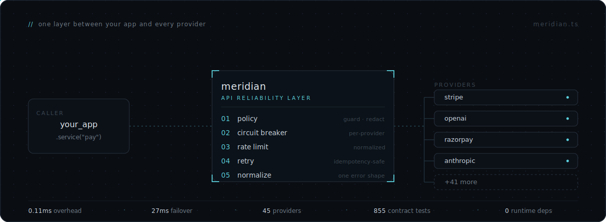

<div align="center">

# Meridian

**Reliability middleware for third-party APIs.**

Stripe returns `{"error":{"type":"..."}}`. OpenAI returns `{"error":{"message":"..."}}`. Razorpay returns something else entirely. Meridian normalizes all of it — errors, rate limits, pagination, retries — so your application never has to care which provider is behind a call. When a provider goes down, idempotent requests (`GET`/`PUT`/`DELETE`) fail over to a healthy one automatically; writes are never silently replayed, since the next provider has no way to know whether the original attempt already happened.

[](https://www.npmjs.com/package/meridianjs)
[](CHANGELOG.md)
[](https://vitest.dev)
[](#providers)
[](#providers)
[](https://www.typescriptlang.org)
[](LICENSE.md)

</div>

```bash
npm install meridianjs
```

> TypeScript-first · ESM · Node ≥ 20 · zero required runtime dependencies

<div align="center">

</div>

---

## The problem

Every third-party API has its own convention for rate-limit headers, pagination cursors, error codes, and retry signals. You end up writing the same glue code for every new provider — and when one goes down, your app goes down with it.

Meridian is a single layer between your app and every provider. You get the same normalized response shape, the same error type, the same retry and failover behavior — no matter which API is behind the call.

---

## Quick start

```typescript
import { Meridian } from "meridianjs";

const meridian = await Meridian.create({
  localUnsafe: true,
  providers: {
    openai:    { auth: { apiKey: process.env.OPENAI_KEY } },
    anthropic: { auth: { apiKey: process.env.ANTHROPIC_KEY } },
  },
});

// Define a service — your app calls "llm", never "openai" or "anthropic" directly.
const llm = meridian.service("llm", ["openai", "anthropic"]);

// OpenAI goes down at 2am. GET is idempotent, so Meridian fails over to
// Anthropic automatically — no risk of double-running the request.
const { data, meta } = await llm.get("/v1/models");

meta.rateLimit.remaining   // always normalized — same field, every provider
meta.pagination?.hasNext   // same
meta.trace.latency         // ms, always present
meta.trace.retries         // how many retries were needed
meta.trace.circuitBreaker  // CLOSED | OPEN | HALF_OPEN
meta.trace.provider        // which provider actually served this request
```

Writes (`POST`/`PATCH`) are never silently replayed on another provider — a failed write surfaces its error immediately instead of risking a duplicate charge or a duplicate LLM call billed twice. See [failover strategies](docs/failover/index.md) for the full picture, including what changes once you add an idempotency key.

Errors are always a `MeridianError` with `.category`, `.retryable`, and `.retryAfter` — no more parsing provider-specific shapes to decide whether to retry.

---

## What Meridian normalizes

| | Raw providers | Through Meridian |
|---|---|---|
| Errors | Different shape per provider | `MeridianError` — always `category`, `retryable`, `retryAfter` |
| Rate limits | Parse per provider | `meta.rateLimit.remaining` — always present |
| Pagination | cursor / offset / link-header per provider | `meta.pagination.hasNext` — always present |
| Retries | Write per provider | Exponential backoff, idempotency-safe, per-adapter classification |
| Circuit breaking | Build yourself | Automatic, per-provider, wraps the retry loop |
| Provider outage | Your app breaks | Automatic failover to the next healthy provider |
| API drift | Silent breakage | `meridian.schema.check()` catches it before prod |

---

## Features

### Reliability
- **[Failover](docs/failover/index.md)** — define a service with ordered fallback providers; Meridian routes around outages automatically
- **[Retries](docs/retries.md)** — per-adapter classification of what's retryable; exponential backoff with full idempotency safety
- **[Rate limiting](docs/rate-limits.md)** — token-bucket per provider with adaptive backoff; shared cooldown across all replicas via `RedisStateStorage` so a 429 on one process backs off the whole fleet
- **[Circuit breaker](docs/circuit-breaker.md)** — per-provider; wraps the retry loop so 3 retries count as one logical failure, not three
- **[Transactions](docs/transactions/index.md)** — multi-provider sagas with compensating rollbacks
- **[Vercel AI SDK middleware](docs/ai-sdk.md)** — `meridianjs/ai`: retries, circuit breaking, and failover across language models via `wrapLanguageModel`, no request translation needed

### Observability & compliance
- **[OpenTelemetry](docs/opentelemetry.md)** — one-line auto-instrumentation; exporter recipes for Datadog, Grafana, Honeycomb, New Relic
- **[Schema drift detection](docs/schema-drift/index.md)** — snapshot provider contracts and gate CI on breaking changes
- **[Contract registry](docs/registry.md)** — versioned snapshots under `.meridian/registry/`, designed to be committed to git
- **[Reliability replay](docs/reliability-replay.md)** — record outage timelines and re-render them locally for post-mortems
- **[Doctor](docs/doctor.md)** — `meridian doctor` turns `.meridian/` (registry drift, recorded outages, breaker activity) plus the runtime into one audit-ranked health check; `--json`/`--strict` for CI
- **[Studio](docs/studio.md)** — local dashboard for health, costs, circuit states, failovers, replay timelines, and schema drift; `await meridian.studio()` or `meridian studio` from the CLI
- **[Policy engine](docs/policies/index.md)** — `blockPII`, `redact`, `denyCountries`, `allowedProviders`, `readOnly` run before every request; no network round-trip on block
- **[India / fintech](docs/fintech.md)** — 13 Indian payment adapters, UPI helpers, Aadhaar/PAN/VPA redaction, DPDPA compliance mode

### Language support
- **[Polyglot](docs/polyglot.md)** — `docker compose up -d` starts the gRPC engine; pre-built clients for **Go**, **Rust**, and **Python** get all 46 providers with no Node.js on the host
- **[CLI](docs/quickstart.md#cli)** — `meridian add <provider> --openapi ./spec.json` generates a fully-tested adapter from an OpenAPI spec
- **[Pagination](docs/pagination.md)** — cursor, offset, and link-header strategies; `meta.pagination` is always the same shape

---

## Polyglot

One engine, any language — no Node.js required on the host:

```bash
cp .env.example .env    # set MERIDIAN_PROXY_TOKEN + provider credentials
docker compose up -d    # gRPC engine on 127.0.0.1:4242
```

```go
// Go — same normalized shape for all 46 providers
c, _ := meridian.Dial(ctx, "127.0.0.1:4242", meridian.WithToken(token))
resp, _ := c.Get(ctx, "stripe", "/v1/customers")
```

```python
# Python — including StreamCall for LLM token streaming
async with MeridianGrpcClient("127.0.0.1:4242", auth_token=token) as client:
    async for chunk in client.anthropic.stream_call("/v1/messages", body={...}):
        print(chunk.data, end="")
```

Go · Rust · Python clients ship in [`clients/`](clients/). Generate one for **C++, Java, C#**, and more straight from `proto/meridian.proto`. See [docs/polyglot.md](docs/polyglot.md).

---

## Security

- **SSRF protection** — every endpoint is validated as a relative path before a request is built; `isSafeEndpoint()` for untrusted input
- **Credential & PII redaction** — `authorization` / `token` / `cookie` always scrubbed from logs and error payloads; opt-in PII coverage including Aadhaar, PAN, VPA in India mode
- **Webhook verification** — timing-safe HMAC checks with timestamp freshness enforcement (matches Stripe's own 5-minute tolerance)
- **Zero required runtime dependencies** — nothing in your supply chain you didn't ask for

See [SECURITY.md](SECURITY.md) for private vulnerability reporting.

---

## Providers

**46 adapters**, each passing the same 19 contract invariants (874 contract tests). Verify any one locally: `npm run test:contracts stripe`.

| Category | Providers |
|---|---|
| **Payments** | Stripe · Razorpay · Cashfree · PayU · Juspay · Braintree · Adyen · Klarna · Mollie · PhonePe · Checkout.com · BillDesk · CCAvenue |
| **AI / LLM** | OpenAI · Anthropic · Gemini · Cohere · Mistral |
| **Communications** | Twilio · SendGrid · Mailgun · Vonage · MSG91 · Exotel · Gupshup |
| **KYC / Identity** | HyperVerge · Digio · Karza · IDfy · Setu · Decentro · Perfios |
| **Tools & Infra** | GitHub · HubSpot · Supabase · Auth0 · Apollo · Hunter · S3 |
| **Mapping** | Google Maps · MapMyIndia |
| **Observability** | Sentry · Datadog |
| **Logistics** | Shiprocket · Delhivery |
| **Other** | Cleartax |

India fintech and compliance details: [docs/fintech.md](docs/fintech.md).

---

## Contributing

New adapter: `npx meridian add <name> --openapi ./spec.json` → review `GENERATED.md` → `npm test`.

[Changelog](CHANGELOG.md) · [License: MIT](LICENSE.md) · [npm](https://www.npmjs.com/package/meridianjs)
