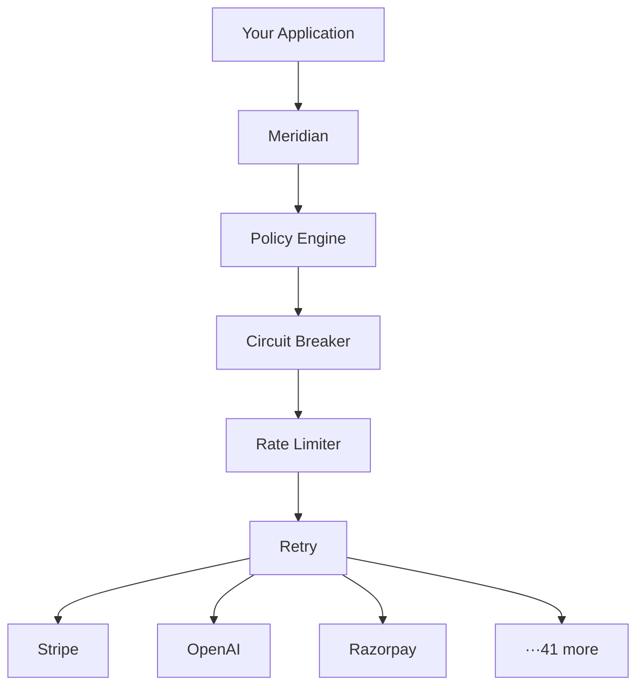
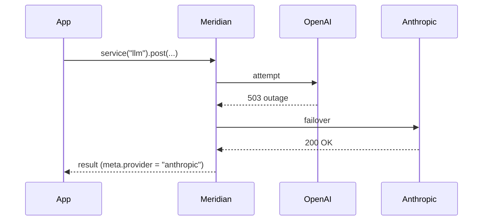
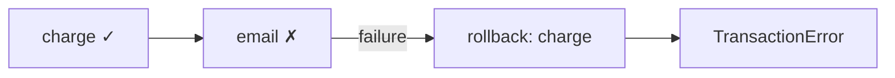

<div align="center">

# Meridian

**API Reliability Layer**

Build once. Survive provider failures.

[](https://www.npmjs.com/package/meridianjs)
[](CHANGELOG.md)
[](https://vitest.dev)
[](#providers)
[](#providers)
[](https://www.typescriptlang.org)
[](LICENSE.md)

46 providers · 874 contract tests · 0.11 ms overhead · 27 ms failover recovery.

</div>

```bash
npm install meridianjs
```

> Requires **Node.js ≥ 20**. TypeScript-first, ships its own types, ESM-only.

<div align="center">


</div>

One layer between your app and every provider. The same retries, error format, failover, and traces — no matter which API is behind it.

---

## Reliability Scorecard

Meridian doesn't claim reliability — it proves it. Every line below is a deterministic assertion against the live pipeline ([`npm run benchmark`](benchmarks/reliability.ts)):

```
✓ 10,000 requests tracked in 1.22s
✓ OpenAI outage recovered via failover in 27ms
✓ Stripe 429 automatically retried
✓ Circuit breaker opened after 5 failures
✓ Schema drift detected before deployment
✓ 45 adapters each pass 19 contract invariants (855 tests total)
```

The runner exits non-zero if any assertion fails — it doubles as a CI gate. Reproduce locally:

```bash
npm run benchmark           # full suite → writes benchmarks/RESULTS.md
npm run benchmark:reliability  # reliability checks only
```

---

## Contents

- [What is Meridian?](docs/what-is-meridian.md) — full positioning doc: what it is, isn't, and why
- [Why Meridian Exists](#why-meridian-exists)
- [How Meridian Compares](#how-meridian-compares)
- [Reliability Scorecard](#reliability-scorecard)
- [Benchmarks](#benchmarks)
- [Architecture](#architecture)
- [Quick Start](#quick-start)
- [What Meridian Does](#what-meridian-does)
- [Provider Failover](#provider-failover)
- [Observability](#observability)
- [Policy Engine](#policy-engine)
- [Transactions](#transactions)
- [Schema Drift Detection](#schema-drift-detection)
- [More Features](#more-features)
- [Security](#security)
- [Providers](#providers)
- [Contributing](#contributing)

---

## Why Meridian Exists

Every integration team rewrites the same things.

Retries. Pagination. Rate limit parsing. Error normalization. Failover logic.

They write it once for Stripe. Then again for Razorpay. Then again for OpenAI. The code is never shared because every provider has a different shape.

Meridian provides a single reliability layer between your application and third-party APIs. Write your integration once. Every provider gets the same retry behavior, the same error format, the same pagination interface, the same circuit breaker, the same trace data.

The two features that make it more than a wrapper:

**Service abstraction** — your application calls `service("payments")`, not `provider("stripe")`. Meridian decides which provider handles the request. Your application is never coupled to a specific vendor.

**Schema drift detection** — providers silently change their API responses. Meridian detects the change before it reaches production.

---

## How Meridian Compares

| | Raw SDKs | LangChain | OpenRouter | API Gateways | **Meridian** |
|---|---|---|---|---|---|
| Unified error format | ❌ | ❌ | Partial (LLM only) | ❌ | ✅ |
| Automatic retries & circuit breakers | ❌ | ❌ | Partial (LLM only) | Partial (inbound only) | ✅ |
| Multi-provider failover | ❌ | Partial (manual chains) | ✅ (LLM only) | ❌ | ✅ (any provider) |
| Schema drift detection | ❌ | ❌ | ❌ | ❌ | ✅ |
| Beyond LLMs (payments, KYC, comms, logistics) | — | ❌ | ❌ | — | ✅ |
| Runs in-process (no extra network hop) | ✅ | ✅ | ❌ (hosted proxy) | ❌ (separate infra) | ✅ |

Full breakdowns: [Meridian vs. Raw SDKs](docs/comparisons/raw-sdks.md) · [vs. LangChain](docs/comparisons/langchain.md) · [vs. OpenRouter](docs/comparisons/openrouter.md) · [vs. API Gateways](docs/comparisons/api-gateways.md)

Already convinced? Jump straight to the [migration guides](docs/migrations/index.md): [from the OpenAI SDK](docs/migrations/from-openai-sdk.md) · [from the Stripe SDK](docs/migrations/from-stripe-sdk.md) · [from OpenRouter](docs/migrations/from-openrouter.md) · [from LangChain](docs/migrations/from-langchain.md)

---

## Benchmarks

Same failures. Different outcomes. Measured in-process against deterministic `MockAdapter`s — no network, fully reproducible. "Raw SDK" = a single provider, no retry, no failover, no circuit breaker.

| Scenario | Raw SDK | Meridian |
|---|---|---|
| OpenAI outage | ❌ Fails every call | ✅ Fails over to Anthropic in 27 ms |
| Stripe 429 | ❌ Gives up | ✅ Retries to success |
| 5 consecutive failures | ❌ Every call hits dead upstream | ✅ Circuit opens; fail-fast in < 1 ms |
| `customer_name` removed silently | ❌ Silent breakage | ✅ `FIELD_REMOVED` ERROR detected |
| Added overhead per call | — | **+0.11 ms** |

Full breakdown: `npm run benchmark` → [`benchmarks/RESULTS.md`](benchmarks/RESULTS.md).

---

## Architecture



---

## Quick Start

```typescript
import { Meridian } from "meridianjs";

const meridian = await Meridian.create({
  localUnsafe: true,
  providers: {
    stripe: { auth: { apiKey: process.env.STRIPE_KEY } },
    openai: { auth: { apiKey: process.env.OPENAI_KEY } },
  },
});

const { data, meta } = await meridian.provider("stripe")!.get("/v1/customers");

meta.rateLimit.remaining  // always normalized
meta.pagination?.hasNext  // always normalized
meta.trace.latency        // ms, always present
meta.trace.retries        // how many retries
meta.trace.circuitBreaker // CLOSED | OPEN | HALF_OPEN
```

---

## What Meridian Does

| | Without | With |
|---|---|---|
| Errors | Different shape per provider | `MeridianError` — always `category`, `retryable`, `retryAfter` |
| Rate limits | Parse per provider | `meta.rateLimit` — normalized |
| Pagination | cursor / offset / link per provider | `meta.pagination` — normalized |
| Retries | Manual | Exponential backoff, idempotency-safe |
| Circuit breaking | Manual | Automatic, per-provider |
| Provider outage | App breaks | Automatic failover |
| API drift | Silent breakage | `meridian.schema.check()` |

---

## Provider Failover

Your app calls `"llm"`. It never touches `"openai"` or `"anthropic"` directly.

```typescript
const meridian = await Meridian.create({
  localUnsafe: true,
  providers: {
    openai:    { auth: { apiKey: "..." } },
    anthropic: { auth: { apiKey: "..." } },
    gemini:    { auth: { apiKey: "..." } },
  },
  services: {
    llm: { providers: ["openai", "anthropic", "gemini"], strategy: "failover" },
  },
});

await meridian.service("llm")!.post("/v1/chat/completions", { body: { ... } });
```



**Routing strategies:** `failover` · `round-robin` · `lowest-latency` · `cheapest` · `highest-success-rate` · `weighted` · `geo`

```typescript
// weighted: 70% Stripe, 30% Razorpay
payments: { providers: ["stripe", "razorpay"], strategy: "weighted", weights: { stripe: 70, razorpay: 30 } }

// geo: route by region (MERIDIAN_REGION env var)
payments: { providers: ["razorpay", "stripe"], strategy: "geo", regions: { "ap-south-1": ["razorpay"], "us-east-1": ["stripe"] } }
```

---

## Observability

Every response includes a trace. No configuration needed.

```typescript
result.meta.trace
// { retries: 2, latency: 341, circuitBreaker: "CLOSED", rateLimitRemaining: 91 }

meridian.analytics()
// { stripe: { requests: 12431, errorRate: "0.3%", avgLatency: 240, p95Latency: 480 } }

meridian.health()
// { stripe: { status: "healthy", successRate: "99.7%", circuitBreaker: "CLOSED" } }

meridian.cost()
// { providers: { openai: { requests: 1243, costPerRequest: 0.03, estimatedSpend: 37.29 } },
//   total: { requests: 1243, estimatedSpend: 37.29 }, since: "2026-06-05T...", currency: "USD" }
```

---

## Policy Engine

Runs before every request. No network round-trip on block.

```typescript
import { blockPII, redact, requireFields, denyCountries, allowedProviders, readOnly, customPolicy } from "meridianjs";

policies: [
  blockPII(["openai"]),                    // blocks credit cards, SSNs, emails, Aadhaar, PAN
  redact(["user.ssn", "card.number"]),     // redacts fields in-place — request still goes through
  requireFields(["tenantId"]),             // blocks if required fields missing
  denyCountries(["KP", "IR"]),            // blocks by ISO 3166-1 country code
  allowedProviders(["openai", "stripe"]),  // provider whitelist
  readOnly(["github"]),                    // no writes
  customPolicy("require-tenant", (ctx) =>
    "tenantId" in (ctx.body as object)
      ? { allow: true }
      : { allow: false, reason: "tenantId required" }
  ),
]
```

---

## Transactions

Saga pattern. Failed steps trigger compensating rollbacks in reverse order.

```typescript
await meridian.transaction([
  {
    name: "charge",
    execute:  () => stripe.post("/v1/charges", { body: { amount: 2000 } }),
    rollback: (r) => stripe.post(`/v1/charges/${r.data.id}/refund`),
  },
  {
    name: "email",
    execute: () => sendgrid.post("/v3/mail/send", { body: { ... } }),
  },
]);
```



---

## Schema Drift Detection

Snapshot a response. Check later. Get alerted when the provider changes their API silently.

```typescript
await meridian.schema.snapshot("stripe", "/v1/customers", response.data);

const drifts = await meridian.schema.check("stripe", "/v1/customers", laterResponse.data);
// [{ type: "FIELD_REMOVED", field: "customer_name", severity: "ERROR" }]

await meridian.schema.alert("stripe", "/v1/customers", newData, (drifts, provider, endpoint) => {
  pagerDuty.trigger(`Schema drift on ${provider}${endpoint}`);
});

const report = await meridian.schema.report("stripe");
// { provider: "stripe", endpoints: [{ endpoint: "/v1/customers", fieldCount: 12, version: "..." }] }
```

---

## More Features

```typescript
// Debug & replay
meridian.debug.enable();
await meridian.replay(requestId); // re-runs with exact original options

// Capability registry
meridian.findProviders({ capability: "streaming" });
// [{ name: "openai" }, { name: "anthropic" }, { name: "gemini" }, ...]

// Adapter generator
// npx meridian generate --provider acme --openapi ./acme.json
// → adapter.ts  adapter.test.ts  pagination.ts  index.ts (8 tests pass immediately)

// Pagination
for await (const page of meridian.provider("stripe")!.paginate("/v1/customers")) { ... }

// Streaming (OpenAI, Anthropic, Gemini, Mistral, Cohere)
for await (const chunk of meridian.provider("openai")!.stream("/v1/chat/completions", { body })) { ... }

// Batch
await meridian.provider("stripe")!.batch([{ method: "GET", endpoint: "/v1/customers/1" }, ...], 5);

// Webhook verification
new StripeAdapter().verifyWebhook(req.rawBody, req.headers["stripe-signature"], secret);

// UPI helpers (NPCI spec — no network call)
import { validateVpa, createUpiDeepLink } from "meridianjs/upi";
validateVpa("merchant@oksbi");                              // true
createUpiDeepLink({ vpa: "merchant@oksbi", amount: 1000 }); // "upi://pay?pa=..."
```

**Subpath exports:** `meridianjs` (core) · `meridianjs/contract` (test harness) · `meridianjs/upi` (UPI helpers)

---

## Security

Meridian holds credentials and routes sensitive payloads for every provider, so the protections are built into the pipeline — not bolted on.

- **Endpoint host-override protection** — every endpoint is validated as a relative path before a request is built. Absolute or protocol-relative endpoints (`https://evil.com`, `//evil.com`, and their encoded/backslash variants) are rejected, so an untrusted endpoint string can never redirect an authenticated request — and its API key — to an unintended host. Pre-validate untrusted input with `isSafeEndpoint()`.
- **Credential & PII redaction** — request options, observability metrics, and error payloads are sanitized. `authorization` / `token` / `cookie` keys are always redacted; opt-in PII redaction covers email, phone, card, and SSN, plus Aadhaar, PAN, VPA, and bank account in India mode (DPDPA).
- **Policy engine** — `blockPII`, `redact`, `denyCountries`, `allowedProviders`, and `readOnly` run before every request, with no network round-trip on block (see [Policy Engine](#policy-engine)).
- **Webhook verification** — timing-safe HMAC signature checks for provider webhooks.
- **Boundary Proxy hardening** — the local proxy supports a required shared secret (`MERIDIAN_PROXY_TOKEN`), refuses to bind to a non-loopback host while unauthenticated, forwards only allowlisted headers (never client `Authorization` / `Cookie`), caps request body size, and redacts credentials and PII from recordings before they touch disk.
- **Supply chain** — zero runtime dependencies, npm provenance on publish, SHA-pinned GitHub Actions, and `npm audit` + OSV scanning in CI.

Found a vulnerability? See [SECURITY.md](SECURITY.md) for private reporting.

---

## Providers

**46 adapters**, each passing the same 19 contract invariants (874 contract tests in total). Verify any one with `npm run test:contracts stripe`.

| Category | Count | Providers |
|---|---|---|
| **Payments** | 13 | Stripe · Razorpay · Cashfree · PayU · Juspay · Braintree · Adyen · Klarna · Mollie · PhonePe · Checkout.com · BillDesk · CCAvenue |
| **AI / LLM** | 5 | OpenAI · Anthropic · Gemini · Cohere · Mistral |
| **Communications** | 7 | Twilio · SendGrid · Mailgun · Vonage · MSG91 · Exotel · Gupshup |
| **KYC / Identity** | 7 | HyperVerge · Digio · Karza · IDfy · Setu · Decentro · Perfios |
| **Tools & Infra** | 7 | GitHub · HubSpot · Supabase · Auth0 · Apollo · Hunter · S3 |
| **Mapping** | 2 | Google Maps · MapMyIndia |
| **Observability** | 2 | Sentry · Datadog |
| **Logistics** | 2 | Shiprocket · Delhivery |
| **Other** | 1 | Cleartax |

---

## Contributing

New adapter: `npx meridian generate --provider name --openapi ./spec.json` → implement TODOs → `npm test`.

[Changelog](CHANGELOG.md) · [License: MIT](LICENSE.md) · [npm](https://www.npmjs.com/package/meridianjs)
