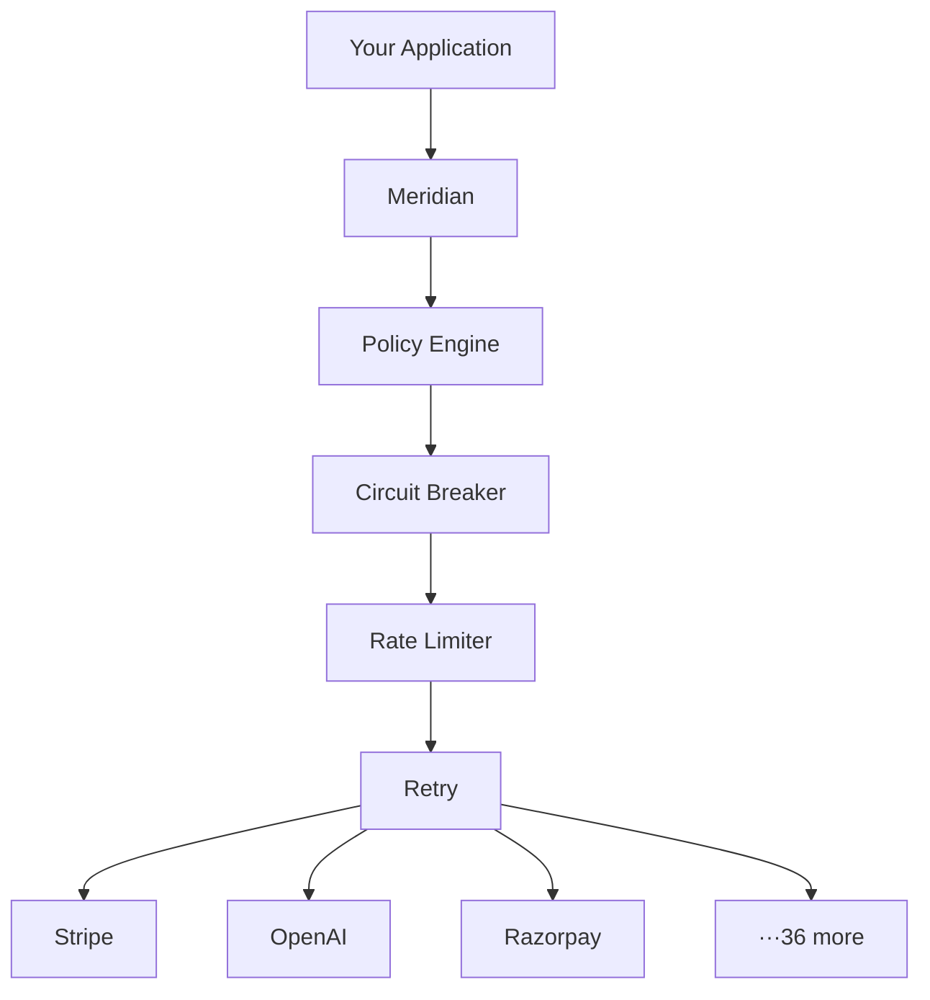
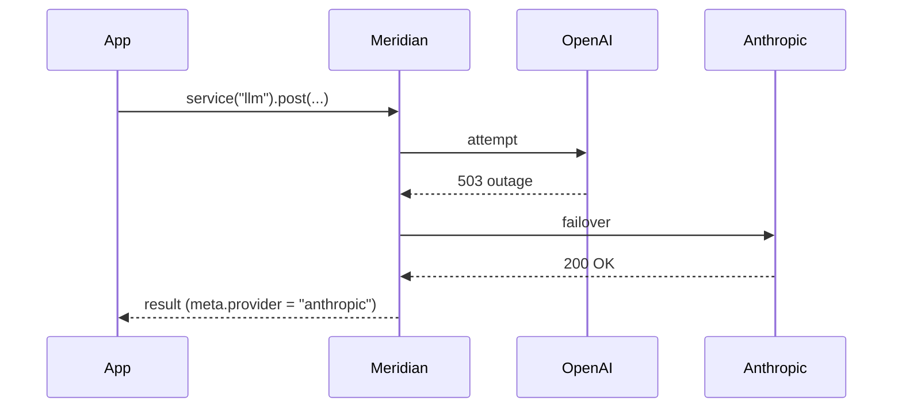
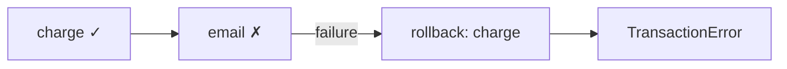

<div align="center">

# Meridian

**Integration Reliability SDK**

[](https://www.npmjs.com/package/meridianjs)
[](https://vitest.dev)
[](#providers)
[](LICENSE.md)

One interface for 39 APIs. Automatic failover. Built-in observability. Zero runtime dependencies.

</div>

```bash
npm install meridianjs
```

---

## Architecture



---

## Quick Start

```typescript
import { Meridian } from "meridianjs";

const meridian = await Meridian.create({
  localUnsafe: true,
  providers: {
    stripe: { auth: { apiKey: process.env.STRIPE_KEY } },
    openai: { auth: { apiKey: process.env.OPENAI_KEY } },
  },
});

const { data, meta } = await meridian.provider("stripe")!.get("/v1/customers");

meta.rateLimit.remaining  // always normalized
meta.pagination?.hasNext  // always normalized
meta.trace.latency        // ms, always present
meta.trace.retries        // how many retries
meta.trace.circuitBreaker // CLOSED | OPEN | HALF_OPEN
```

---

## What Meridian Does

| | Without | With |
|---|---|---|
| Errors | Different shape per provider | `MeridianError` — always `category`, `retryable`, `retryAfter` |
| Rate limits | Parse per provider | `meta.rateLimit` — normalized |
| Pagination | cursor / offset / link per provider | `meta.pagination` — normalized |
| Retries | Manual | Exponential backoff, idempotency-safe |
| Circuit breaking | Manual | Automatic, per-provider |
| Provider outage | App breaks | Automatic failover |
| API drift | Silent breakage | `meridian.schema.check()` |

---

## Provider Failover

Your app calls `"llm"`. It never touches `"openai"` or `"anthropic"` directly.

```typescript
const meridian = await Meridian.create({
  localUnsafe: true,
  providers: {
    openai:    { auth: { apiKey: "..." } },
    anthropic: { auth: { apiKey: "..." } },
    gemini:    { auth: { apiKey: "..." } },
  },
  services: {
    llm: { providers: ["openai", "anthropic", "gemini"], strategy: "failover" },
  },
});

await meridian.service("llm")!.post("/v1/chat/completions", { body: { ... } });
```



**Routing strategies:** `failover` · `round-robin` · `lowest-latency` · `cheapest` · `highest-success-rate`

---

## Observability

Every response includes a trace. No configuration needed.

```typescript
result.meta.trace
// { retries: 2, latency: 341, circuitBreaker: "CLOSED", rateLimitRemaining: 91 }

meridian.analytics()
// { stripe: { requests: 12431, errorRate: "0.3%", avgLatency: 240, p95Latency: 480 } }

meridian.health()
// { stripe: { status: "healthy", successRate: "99.7%", circuitBreaker: "CLOSED" } }
```

---

## Policy Engine

Runs before every request. No network round-trip on block.

```typescript
import { blockPII, allowedProviders, readOnly, customPolicy } from "meridianjs";

policies: [
  blockPII(["openai"]),                    // blocks credit cards, SSNs, emails, Aadhaar, PAN
  allowedProviders(["openai", "stripe"]),   // whitelist
  readOnly(["github"]),                     // no writes
  customPolicy("require-tenant", (ctx) =>
    "tenantId" in (ctx.body as object)
      ? { allow: true }
      : { allow: false, reason: "tenantId required" }
  ),
]
```

---

## Transactions

Saga pattern. Failed steps trigger compensating rollbacks in reverse order.

```typescript
await meridian.transaction([
  {
    name: "charge",
    execute:  () => stripe.post("/v1/charges", { body: { amount: 2000 } }),
    rollback: (r) => stripe.post(`/v1/charges/${r.data.id}/refund`),
  },
  {
    name: "email",
    execute: () => sendgrid.post("/v3/mail/send", { body: { ... } }),
  },
]);
```



---

## Schema Drift Detection

Snapshot a response. Check later. Get alerted when the provider changes their API silently.

```typescript
await meridian.schema.snapshot("stripe", "/v1/customers", response.data);

const drifts = await meridian.schema.check("stripe", "/v1/customers", laterResponse.data);
// [{ type: "FIELD_REMOVED", field: "customer_name", severity: "ERROR" }]
```

---

## More Features

```typescript
// Debug & replay
meridian.debug.enable();
await meridian.replay(requestId); // re-runs with exact original options

// Capability registry
meridian.findProviders({ capability: "streaming" });
// [{ name: "openai" }, { name: "anthropic" }, { name: "gemini" }, ...]

// Adapter generator
// npx meridian generate --provider acme --openapi ./acme.json
// → adapter.ts  adapter.test.ts  pagination.ts  index.ts (8 tests pass immediately)

// Pagination
for await (const page of meridian.provider("stripe")!.paginate("/v1/customers")) { ... }

// Streaming (OpenAI, Anthropic, Gemini, Mistral, Cohere)
for await (const chunk of meridian.provider("openai")!.stream("/v1/chat/completions", { body })) { ... }

// Batch
await meridian.provider("stripe")!.batch([{ method: "GET", endpoint: "/v1/customers/1" }, ...], 5);

// Webhook verification
new StripeAdapter().verifyWebhook(req.rawBody, req.headers["stripe-signature"], secret);
```

---

## Providers

39 adapters, each passing 19 contract invariants. `npm run test:contracts stripe`

| Category | Providers |
|---|---|
| **Payments** | Stripe · Razorpay · Cashfree · PayU · Juspay · Braintree · Adyen · Klarna · Mollie · PhonePe · Checkout.com |
| **AI / LLM** | OpenAI · Anthropic · Gemini · Cohere · Mistral |
| **Communications** | Twilio · SendGrid · Mailgun · Vonage · MSG91 · Exotel · Gupshup |
| **KYC / Identity** | HyperVerge · Digio · Karza · IDfy · Setu · Decentro · Perfios |
| **Tools & Infra** | GitHub · HubSpot · Supabase · Auth0 · Apollo |
| **Logistics** | Shiprocket · Delhivery |
| **Other** | MapMyIndia · Cleartax |

---

## Contributing

New adapter: `npx meridian generate --provider name --openapi ./spec.json` → implement TODOs → `npm test`.

[Changelog](CHANGELOG.md) · [License: MIT](LICENSE.md) · [npm](https://www.npmjs.com/package/meridianjs)
